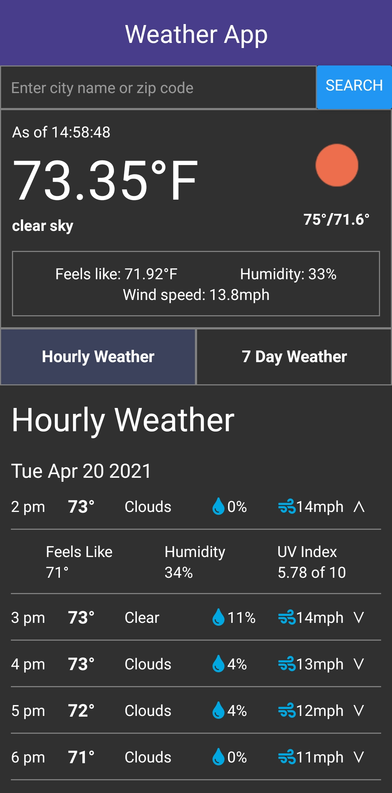

# Mobile Weather App

This is a mobile weather app created using React Native. It pulls weather data from OpenWeatherMap's API through a search of either city name or zip code. I utilized their 'Current Weather Data' API for current weather data as well as their 'One Call' API for the hourly and daily forecasts.

The main panel shows the current temperature, humidity, and wind speed. Underneath there are two tabs to show either the hourly or 7 day weather with expanding panels for more information for the relevant hour or day. The app also saves the most recent search and loads the weather data using that search upon the next app launch. 

